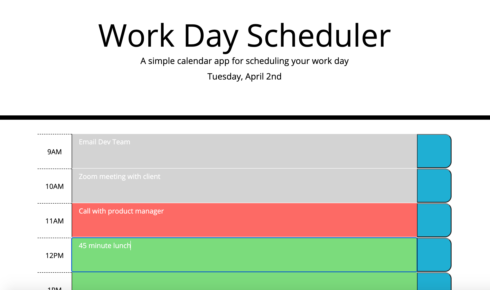

Third-Party APIs Challenge: Work Day Scheduler

User Story: AS AN employee with a busy schedule
I WANT to add important events to a daily planner
SO THAT I can manage my time effectively

Acceptance Criteria: GIVEN I am using a daily planner to create a schedule
WHEN I open the planner
THEN the current day is displayed at the top of the calendar
WHEN I scroll down
THEN I am presented with time blocks for standard business hours
WHEN I view the time blocks for that day
THEN each time block is color-coded to indicate whether it is in the past, present, or future
WHEN I click into a time block
THEN I can enter an event
WHEN I click the save button for that time block
THEN the text for that event is saved in local storage
WHEN I refresh the page
THEN the saved events persist

Description:
Created a day planner that has dynamically updated HTML and CSS powered via jQuery. This planner allows employees with busy schedules to effectively organize their work day by the hour. Depending on the current time of day, the time slots will change color to depict past, present, or future tasks. The user is also able to save their tasks to the local storage by clicking the blue save button. This way, the user won't lose their saved tasks if the page is accidentally closed or refreshed.

Screenshots:

URL of Deployed Application: https://aidanwanberg.github.io/work-day-scheduler/

URL of GitHub Repository: https://github.com/aidanwanberg/work-day-scheduler